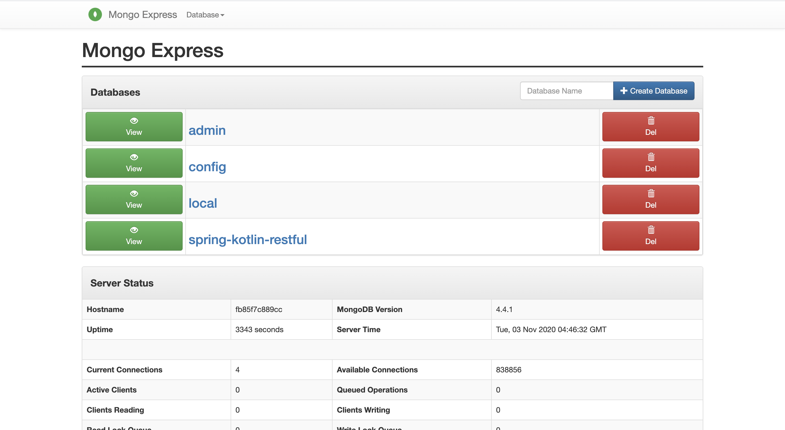
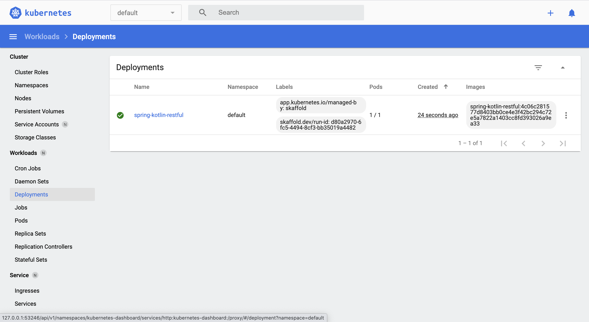
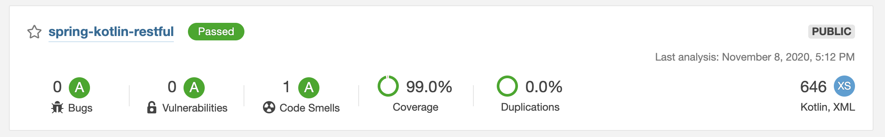

## Table of Contents

* [About the Project](#about-the-project)
* [Getting Started](#getting-started)
  * [Maven](#maven)
  * [Docker](#docker)
  * [Kubernetes](#kubernetes-using-skaffold)
  * [Code Inspection using Sonarqube](#code-inspection-using-sonarqube)
* [API Spec](#api-spec)
* [Contributions](#contributions)
* [Appendix](#appendix)

<!-- ABOUT THE PROJECT -->
## About The Project
Spring kotlin restful is project for explore Spring Boot, Kotlin, Docker, Kubernetes, Sonarqube etc


<!-- GETTING STARTED -->
## Getting Started
This project can run using maven, docker or kubernetes with skaffold

## Maven
This project use mongodb as database, so make sure you have running mongodb in local environment, or you can run docker-compose file inside docker-compose folder
* Make sure you have docker installation, if not see [Docker Get Started](https://www.docker.com/get-started)
* Run mongodb using docker compose, see [Docker Compose](https://docs.docker.com/compose/) for more info

```
docker-compose -f docker-compose/mongodb-compose.yaml up -d
```

* Open `localhost:8081` to se mongo-express using default user password `admin:admin`

* Run project using maven (skip test and using local profile) `Ctrl + C` for close running project

```
mvn spring-boot:run -DskipTests -Plocal
```
* Explore api, see [API Spec](#api-spec)

## Docker
* Before you can run project using docker make sure mongodb run using docker compose with `mongodb-compose.yaml` file
* Docker compose `mongodb-compose.yaml` using `spring-kotlin` as network so make sure you run with set network to `spring-kotlin`
* You can run this common (add -d to run in background)

```
docker run --name spring-kotlin --network=spring-kotlin -p 8080:8080 -e "SPRING_PROFILES_ACTIVE=docker" sukendakenda/spring-kotlin-restful
```
* Docker will pull image from docker hub with name `sukendakenda/spring-kotlin-restful`
* You can build image using [Jib Maven Plugin](https://github.com/GoogleContainerTools/jib/tree/master/jib-maven-plugin) and push to your docker hub
* Make sure you change docker id in `pom.xml` to `<image>[your-docker-id]/spring-kotlin-restful</image>` 
* Login to your docker hub using
```
docker login -u <your-docker-id>
```
* Run this common for build image
```
mvn compile jib:dockerBuild
```
* Run this common for build image and push image to your docker hub
```
mvn compile jib:build
```

## Kubernetes using skaffold

Before you can develop application on kubernetes using skaffold you must have `minikube` on local, to install `minikube` on local you can see [Minikube](https://minikube.sigs.k8s.io/docs/start/)
* Start minikube using
```
minikube start
```
* Open minikube dashboard using
```
minikube dashboard
```
* Make sure you have `Skaffold` install on local or you can see [Skaffold](https://skaffold.dev/docs/quickstart/)
```
skaffold version
```
* Build image using `skaffold.yml` file using
```
skaffold build
```
* Build image and deploy to kubernetes using
```
skaffold run
```
* See pods using 
```
kubectl get pods
```
or 
```
kubectl get all
```
* Available common on kubernetes see [Kubernetes](https://kubernetes.io/docs/reference/kubectl/cheatsheet/)
* Open application running using
```
minikube service spring-kotlin-restful
```
* Delete deployment and service using
```
kubectl delete deployment spring-kotlin-restful
```
```
kubectl delete service spring-kotlin-restful
```
* If you want to build and deploy when your code changes use this common
```
skaffold dev
```

## Code Inspection using Sonarqube
Before you can inspect code make sure you run sonarqube server using docker compose
* Run this common for running sonarqube using docker compose
```
docker-compose -f docker-compose/sonar-compose.yaml up -d
```
* Open `localhost:9000` to see if sonarqube running
* Run inspect code using common
```
mvn verify sonar:sonar
```


## API Spec

## Contributions

## Appendix
This common used when learning spring boot kotlin

## Mongodb
- `kubectl exec -it <POD> /bin/bash`
- `mongo`
- `mongo -u spring-kotlin-user -p --authenticationDatabase spring-kotlin-restful`

## SSH Github with multiple account
* Generate ssh-keygen
```
ssh-keygen -t rsa -C "youremail@gmail.com" -f "github-youremail"
```
```
ssh-keygen -t rsa -C "otheremail@gmail.com" -f "github-otheremail"
```
* Add ssh-keygen
```
ssh-add -K ~/.ssh/github-youremail
```
```
ssh-add -K ~/.ssh/github-otheremail
```

* Copy public key
```
pbcopy < ~/.ssh/github-youremail.pub
```
```
pbcopy < ~/.ssh/github-otheremail.pub
```
* See [Github SSH](https://docs.github.com/en/free-pro-team@latest/github/authenticating-to-github/adding-a-new-ssh-key-to-your-github-account)

* Edit config
```
vi ~/.ssh/config
```

* Config File
```
Host github.com-youremail
     HostName github.com
     User git
     IdentityFile ~/.ssh/github-youremail
     
 Host github.com-otheremail
     HostName github.com
     User git
     IdentityFile ~/.ssh/github-otheremail
```

## Default github account
```
git config --global user.name "username"
```
```
git config --global user.email "youremail@gmail.com"
```

```
git config --global user.name "otherusername"
```
```
git config --global user.email "otheremail@gmail.com"
```
## Clone repo using specific account
```
git clone git@github.com-{your-username}:{the-repo-organisation-or-owner-user-name}/{the-repo-name}.git
```
```
git clone git@github.com-sukenda:sukenda/spring-boilerplate.git
```
```
git clone git@github.com-sukendakenda:sukenda/spring-boilerplate.git
```

## Git common collaboration
```
git clone git@github.com-sukendakenda:sukendakenda/spring-boilerplate.git
```
```
git remote
```
```
git remote add upstream git@github.com-sukendakenda:sukenda/spring-boilerplate.git
```
```
git fetch upstream
```
```
git branch --set-upstream-to=upstream/master master
```
```
git checkout -b new-branch
```
